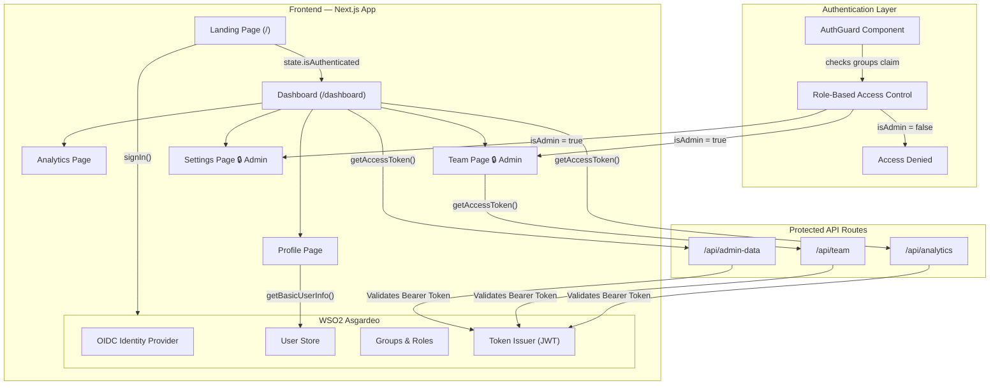

# 🏢 B2B Enterprise Portal

A multi-page enterprise dashboard built with **Next.js** and secured using **WSO2 Asgardeo** for authentication and role-based access control.

## WSO2 Asgardeo Features Used

| Feature | How It's Used |
|---------|---------------|
| **OAuth 2.0 / OIDC Authentication** | Users sign in via Asgardeo's hosted login page using Authorization Code flow with PKCE |
| **User Profile (ID Token Claims)** | Profile page reads `username`, `email`, `sub`, `groups` from the Asgardeo ID token |
| **Role-Based Access Control (RBAC)** | Admin-only pages (Team, Settings) are gated using the `groups` claim from Asgardeo |
| **Protected API Routes (Bearer JWT)** | Backend API routes validate the Asgardeo-issued access token before returning data |
| **Session Management** | AuthGuard component auto-redirects unauthenticated users to the Asgardeo login flow |

## Architecture



## Pages

| Route | Access | Description |
|-------|--------|-------------|
| `/` | Public | Landing page with Asgardeo login button |
| `/dashboard` | Authenticated | Overview with stats from protected API |
| `/dashboard/profile` | Authenticated | User identity from Asgardeo ID token |
| `/dashboard/analytics` | Authenticated | Login metrics and auth method charts |
| `/dashboard/team` | **Admin Only** | Team members table (RBAC via groups) |
| `/dashboard/settings` | **Admin Only** | Org config showing Asgardeo settings |

## Getting Started

### Prerequisites
- Node.js 18+
- A [WSO2 Asgardeo](https://asgardeo.io/) account with a Single Page Application configured

### Setup

1. Clone the repository:
```bash
git clone https://github.com/your-username/b2b-enterprise-portal.git
cd b2b-enterprise-portal
```

2. Install dependencies:
```bash
npm install
```

3. Create a `.env` file with your Asgardeo credentials:
```env
NEXT_PUBLIC_ASGARDEO_SIGN_IN_REDIRECT_URL="http://localhost:3000"
NEXT_PUBLIC_ASGARDEO_SIGN_OUT_REDIRECT_URL="http://localhost:3000"
NEXT_PUBLIC_ASGARDEO_CLIENT_ID="your-client-id"
NEXT_PUBLIC_ASGARDEO_BASE_URL="https://api.asgardeo.io/t/your-org"
```

4. Run the development server:
```bash
npm run dev
```

5. Open [http://localhost:3000](http://localhost:3000) in your browser.

## Tech Stack

- **Framework:** Next.js 16 (App Router)
- **Language:** TypeScript
- **Styling:** Tailwind CSS 4
- **Auth:** WSO2 Asgardeo SDK (`@asgardeo/auth-react`)
- **Auth Protocol:** OAuth 2.0 + OpenID Connect

## RBAC Implementation

Access control uses the `groups` claim returned in the Asgardeo ID token:

```typescript
// AuthGuard checks the groups claim from Asgardeo
const info = await getBasicUserInfo();
const groups = info?.groups || [];
const isAdmin = groups.some(g => g.toLowerCase().includes("admin"));

// If requireAdmin is true and user is not admin → Access Denied
```

To assign a user as admin, add them to an "Admin" group in the Asgardeo Console under **User Management > Groups**.
